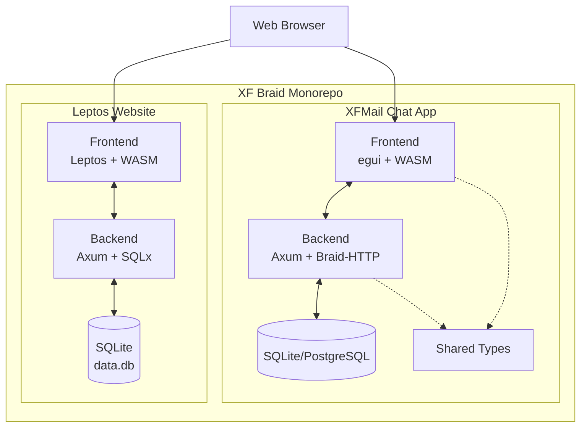

# XF Braid

A monorepo containing two Rust web applications: a Leptos-based website and XFMail, a real-time collaborative chat application.

## Architecture Overview



## Project Structure

```
xf_braid/
├── backend/              # Leptos website backend
│   └── src/
│       ├── auth.rs       # JWT authentication
│       ├── db.rs         # SQLx database
│       ├── error.rs      # Error handling
│       └── main.rs       # Axum server
├── frontend/             # Leptos website frontend
│   ├── src/              # Rust components
│   ├── style/            # Tailwind CSS
│   └── public/           # Static assets
├── xfmail/               # Chat application workspace
│   ├── backend/          # Chat backend
│   │   └── src/
│   │       ├── auth/     # Authentication
│   │       ├── collab/   # CRDT collaboration
│   │       ├── messaging/# Chat logic
│   │       ├── realtime/ # WebSocket handlers
│   │       ├── routes/   # API routes
│   │       └── server/   # Server initialization
│   ├── frontend-egui/    # WASM chat client
│   │   └── src/
│   │       ├── auth.rs   # Client auth
│   │       ├── messaging/# Chat UI
│   │       ├── platform/ # Web/Native abstraction
│   │       └── state/    # App state
│   └── shared/           # Shared types
├── .env                  # Environment configuration
├── docker-compose.yml    # Multi-service deployment
├── Dockerfile.leptos     # Leptos container
└── leptos-local.bat      # Development scripts
```

## Technology Stack

### Leptos Website
- **Frontend**: Leptos 0.8 (SSR/hydration), Tailwind CSS
- **Backend**: Axum 0.8, SQLx, JWT authentication
- **Database**: SQLite

### XFMail Chat
- **Frontend**: egui (immediate-mode GUI), WASM
- **Backend**: Axum 0.8, Braid-HTTP protocol, Tower middleware
- **Collaboration**: Diamond-Types CRDT
- **Database**: SQLite or PostgreSQL
- **Real-time**: WebSocket subscriptions

## Key Features

### Leptos Website
- Server-side rendering with hydration
- Tailwind CSS styling
- JWT-based authentication
- SQLite database with migrations

### XFMail Chat
- Real-time collaborative editing
- Braid-HTTP protocol implementation
- CRDT-based conflict resolution
- WebSocket persistent connections
- Offline-first architecture
- Cross-platform (Web + Native via egui)

## Development

### Prerequisites
- Rust 1.90+
- Node.js (for Tailwind CSS)
- Trunk (for WASM builds): `cargo install trunk`
- cargo-leptos: `cargo install cargo-leptos`

### Local Development

#### Leptos Website
```bash
leptos-local.bat
# Or manually:
cargo leptos watch
```
Access at: http://localhost:3000

#### XFMail Chat
```bash
xfmail-local.bat
# Or manually:
cd xfmail/backend && cargo run --features ssr
```
Access frontend at: http://localhost:3000/xfmail/

Build frontend separately:
```bash
cd xfmail/frontend-egui
trunk build --features web
```

### Environment Variables

Copy `.env.example` to `.env` and configure:

```env
# Leptos site
DATABASE_URL=sqlite:./data.db?mode=rwc
JWT_SECRET=your-secret-key
HOST=0.0.0.0
PORT=3000

# XFMail chat
XFMAIL_DATABASE_URL=sqlite:./xfmail/backend/data.db?mode=rwc
SERVER_PORT=3001
RUST_LOG=info,xfmail=debug
DEV_AUTH_BYPASS=0
```

## Deployment

### Docker Compose (Recommended)

Deploy both applications with a single command:

```bash
docker-compose up -d
```

This starts:
- Leptos website on port 3000
- XFMail backend on port 3001

### Individual Deployment

#### Leptos (Fly.io)
```bash
./start_fly.sh
```

#### Manual Docker Build
```bash
# Leptos
docker build -f Dockerfile.leptos -t xf-braid-site .

# XFMail
cd xfmail
docker build -t xfmail-backend .
```

## Cross-Platform Compatibility

### Docker Configuration
- Multi-stage builds for minimal image size
- Platform-agnostic base images (Debian Bookworm Slim)
- No host-specific paths or dependencies
- Environment-based configuration (12-factor app)

### Supported Platforms
- Linux (x86_64, ARM64)
- Windows (via WSL2 or native Docker Desktop)
- macOS (Intel and Apple Silicon)

## Architecture Details

### Leptos Website Flow
```
Browser Request
    ↓
Axum Router
    ↓
Leptos SSR → HTML with embedded WASM
    ↓
Browser Hydration → Interactive SPA
    ↓
API Calls → Axum Handlers → SQLx → SQLite
```

### XFMail Chat Flow
```
Browser WASM Client (egui)
    ↓
WebSocket Connection
    ↓
Braid-HTTP Protocol
    ↓
Backend Router (Axum + Tower)
    ↓
├─ Auth Middleware → JWT Validation
├─ CRDT Collaboration → Diamond-Types
└─ Message Persistence → Database
```

### CRDT Synchronization
XFMail uses Diamond-Types for conflict-free replicated data types:
- Operational transformation for text editing
- Vector clocks for causality tracking
- Automatic merge conflict resolution
- Offline-first with eventual consistency

## API Endpoints

### Leptos Website
- `GET /` - Homepage
- `POST /api/auth/login` - User login
- `POST /api/auth/signup` - User registration
- Various page routes

### XFMail Chat
- `POST /api/auth/register` - Create account
- `POST /api/auth/login` - Authenticate
- `WS /realtime` - WebSocket subscription (Braid-HTTP)
- `GET /api/* ` - REST endpoints

## BraidFS Integration

`xf_braid` implements a custom Rust client for the [Braid-HTTP](https://github.com/braid-org/braid-spec) protocol, enabling decentralized, peer-to-peer file synchronization.

### 1. Protocol Implementation
*   **Custom Client**: The `xf_braid` client (`braid_fetch`) implements the Braid-HTTP protocol from scratch.
*   **Subscriptions**: It sends `Subscribe: true` headers to initiate open-ended response streams, allowing the server to push updates (patches) in real-time without polling.
*   **Headers**: It correctly handles `Version` (current state), `Parents` (causality), and `Patches` (delta updates) headers to ensure eventual consistency.

### 2. Hybrid Storage Engine
To support both Desktop and Web targets with 1:1 parity, the storage layer is abstracted via the `BraidStorage` trait:
*   **Abstraction**: A `BraidStorage` trait abstracts the underlying file system.
*   **Desktop (Native)**: Uses `std::fs` to read/write directly to the user's disk (e.g., `~/http`) and `notify` to watch for external file changes.
*   **Web (WASM)**: Uses a virtual file system on top of the browser's `LocalStorage`, allowing the same sync logic to run entirely in the browser.

### 3. Synchronization Logic & Diffing
*   **Efficiency**: Instead of sending full file contents, `xf_braid` uses the **Myers diff algorithm** (via the `dissimilar` crate) to compute minimal differences (Inserts/Deletes) between the local and remote versions.
*   **Versioning**: A persistent `VersionStore` tracks the "Version Vector" (known states) to ensure that when you edit a file, the `Parents` you send correctly reflect the version you started with, preventing accidental overwrites (Conflict-Free).
*   **Loop Avoidance**: An internal `PendingWrites` registry prevents local file watchers from triggering infinite sync loops when applying remote updates.

## Database Schema

### Leptos
- `users` - User accounts and credentials
- Standard auth tables

### XFMail
- `users` - User accounts
- `messages` - Chat messages with CRDT metadata
- `conversations` - Chat rooms/threads
- `crdt_operations` - Operational transform log

## Testing

```bash
# Run all tests
cargo test --workspace

# Test specific crate
cd xfmail/backend
cargo test --features ssr

# Frontend WASM tests
cd xfmail/frontend-egui
wasm-pack test --headless --firefox
```

## Production Checklist

- [ ] Change `JWT_SECRET` in `.env`
- [ ] Use PostgreSQL for XFMail (not SQLite)
- [ ] Set `RUST_LOG=info` (disable debug logs)
- [ ] Set `DEV_AUTH_BYPASS=0`
- [ ] Configure CORS for specific origins
- [ ] Set up SSL/TLS certificates
- [ ] Configure database backups
- [ ] Set up monitoring and alerting

## Contributing

This is a personal project demonstrating advanced Rust web development patterns.

## License

Proprietary
